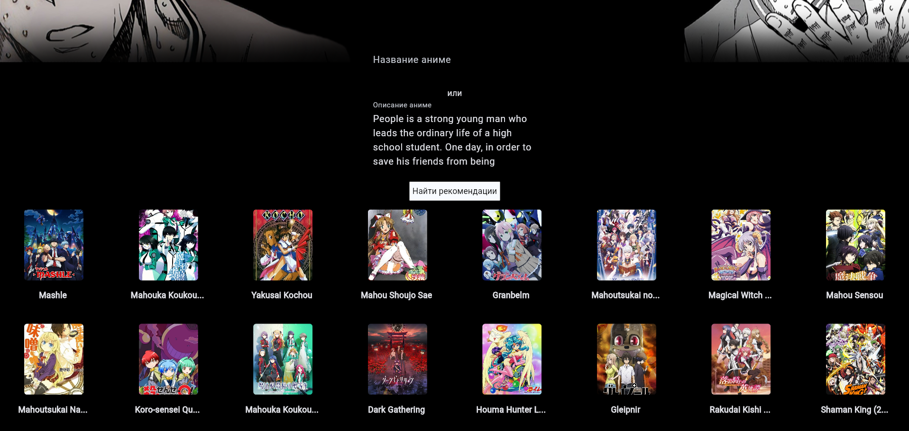
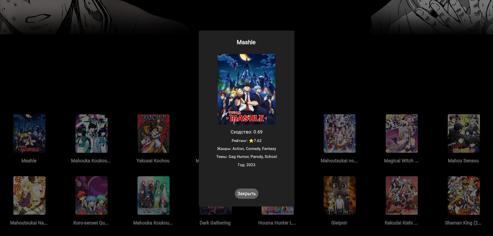

<div align="center">
  
</div>

## 🎌 Anime Recommendation System 
Anime Recommendation System - это система для поиска похожих аниме. Она включает анализ смысла описаний аниме и нахождение семантически похожих тайтлов. Можно искать как по описанию аниме, так и по его названию. Но "по названию" аниме подразумевает себя внутри поиск тоже по описанию. Название ищется у микросервиса в его базе.

## ✨ Ключевые особенности
- Благодаря использованию эмбеддинга, система понимает смысл описаний, а не просто ключевые слова.
- Работает с русскими и английскими описаниями.
- Использование оптимизированных алгоритмов поиска похожих аниме с использованием FAISS.

## Что включает в себя система
- Модуль с аниме рекомендатором (с использованием FAISS) 
- Микросервис для выдачи рекомендаций (FastApi)
- Веб-приложение на Flet

## Данные 
Данные для системы были взяты с сайта kaggle: [Anime Database - july 2025](https://www.kaggle.com/code/sonawanelalitsunil/anime-database-july-2025-ml-67-2) 
Датасет содержит 28 фичей и около 29 тысяч объектов. После обработки данных число аниме сократилось до 25 тысяч, т.к в убранных объектах не было описания. Из фичей оставил, на мой взгляд, только 10 послезных. 
В колонках жанры, темы, форматы аниме были пропуски. Их я заменял обычным текстом "none" (заменять их модой или чем-нибудь еще было нелогично). 

## 🖼️ Демонстрация 
<div align="center">

| Главный экран | Рекомендации | Детали аниме |
|---------------|--------------|--------------|
|  |  |  |

</div>
Здесь было взято описание аниме "Магическая битва" (Проклятая энергия, магический колледж, сражения) 
Первые два порекомендованных аниме:
- Магия и мускулы (Магия, академия магов, сражения) 
- Непутёвый ученик в школе магии (Магия, школа магии, сражения)

## 🏗️ Структура проекта
```text
AnimeRecommendation/
├── backend/                         
│   ├── data_structure.py        # Pydantic Model             
│   └── service.py               # FastAPI приложение
├── config/                         
│   └── config_file.py                                   
├── data/                                        
│   └── anime_dataset.csv        # Необработанный датасет
├── faiss/                         
│   ├── data.parquet             # Отобранные и обработанные данные
│   └── index.faiss              # Faiss индексы
├── frontend/                         
│   ├── assets/
│   ├── app.py                   # Веб-приложение
│   ├── grid_view.py             # Контейнер для аниме тайтлов
│   └── main_page.py             # Главная страница
├── ml_core/                                        
│   └── anime_recommender.py     # Рекомендатор
├── notebooks/    
│   ├── EDA.ipynb                 
│   └── Recommender.ipynb
└── README.md
```
## 📚 Использование 
Поиск по названию: 
- Введите название аниме в поле "Название аниме" 
- Нажмите "Найти рекомендации" 
- Система найдет семантически похожие тайтлы 

Поиск по описанию: 
- Опишите сюжет в поле "Описание аниме" 
- Нажмите "Найти рекомендации" 
- Получите релевантные рекомендации на основе описания

Пример запроса:
```json
# Поиск по названию
{
  "title": "Mashle", # Название аниме
  "synopsis": "", # Описание аниме
  "k": 16 # Число выводимых рекомендаций
}
``` 
Изначально рекомендер смотрит на "title" из запроса и выводит рекомендации по названию. Если название аниме пусто, то рекомендер смотрит на "synopsis" и выдает рекомендации по описанию. Если и описания и названия нет - снизу вылезет уведомление об ошибке.


